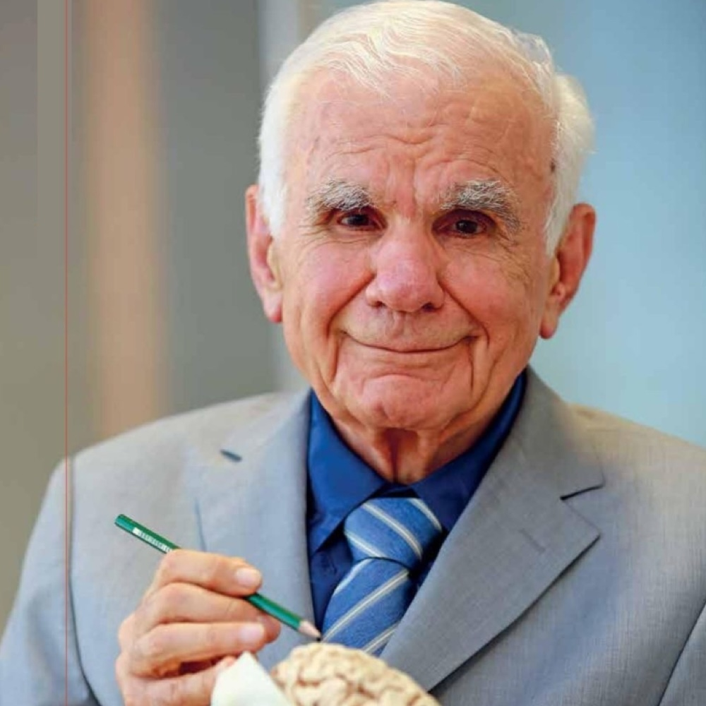

<!-- Pantheon Turkey -->

<h1>Pantheon Turkey</h1>

Pantheon Turkey is a digital memorial that honors artists and scientists who have made a significant impact across Turkey through their contributions to the arts and sciences.  
Stay informed about recent passings and commemorative events organized by Pantheon Turkey held in honor of selected individuals. Join our e-mail newsletter: [Subscribe](https://pantheonturkey.kit.com/subscribe)  
To help expand this tribute, you can nominate a distinguished individual through our [Nomination Page](nomination.md).

 

<h3>In Memoriam</h3>
 

<h3>2025</h3>

|  |  |  |
|:-:|:-:|:-:|
|Ferdi Tayfur (1945-2025)|Ayla Erduran (1934-2025)|Edip Akbayram (1950-2025)|

|  |  |  |
|:-:|:-:|:-:|
|Filiz Akın (1943-2025)| Volkan Konak (1967-2025)|Gazi Yaşargil (1925-2025)|

 

 
Copyright © 2025 - &#8734; Pantheon Turkey All Right Reserved
 

